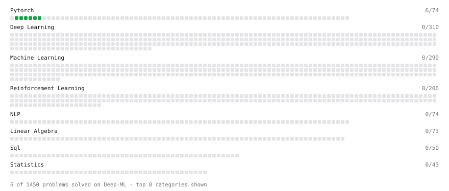

# Deep-ML

My machine learning practice from [Deep-ML](https://www.deep-ml.com). Every solution here was written by hand.

**12** solved · 12 problems · 0 labs · 0 math

[**Browse the interactive portfolio**](https://MM1026-DS.github.io/deep-ml/) to replay this filling in over time.

## Problems

| | Difficulty | Solved | |
| --- | --- | --- | --- |
| [Add a Bias Vector to a Batch via Broadcasting](https://www.deep-ml.com/problems/882) | easy | 2026-09-25 | [solution](problems/0882-add-a-bias-vector-to-a-batch-via-broadcasting) |
| [Backprop a Linear Layer by Hand](https://www.deep-ml.com/problems/898) | easy | 2026-09-26 | [solution](problems/0898-backprop-a-linear-layer-by-hand) |
| [Build a Dataset and Use It with a DataLoader](https://www.deep-ml.com/problems/899) | easy | 2026-09-26 | [solution](problems/0899-build-a-dataset-and-use-it-with-a-dataloader) |
| [Build a Linear Regression Model with nn.Module](https://www.deep-ml.com/problems/885) | easy | 2026-09-26 | [solution](problems/0885-build-a-linear-regression-model-with-nn-module) |
| [Build an MLP with nn.Sequential](https://www.deep-ml.com/problems/887) | easy | 2026-09-26 | [solution](problems/0887-build-an-mlp-with-nn-sequential) |
| [Compute a Gradient with PyTorch Autograd](https://www.deep-ml.com/problems/884) | easy | 2026-09-26 | [solution](problems/0884-compute-a-gradient-with-pytorch-autograd) |
| [Implement a Linear Layer Forward Pass with Matrix Multiplication](https://www.deep-ml.com/problems/883) | easy | 2026-09-25 | [solution](problems/0883-implement-a-linear-layer-forward-pass-with-matrix-multiplication) |
| [Implement Dropout from Scratch](https://www.deep-ml.com/problems/901) | easy | 2026-09-26 | [solution](problems/0901-implement-dropout-from-scratch) |
| [Reshape and Transpose a Tensor](https://www.deep-ml.com/problems/881) | easy | 2026-09-25 | [solution](problems/0881-reshape-and-transpose-a-tensor) |
| [Run One Training Step: Forward, Loss, Backward, Optimizer](https://www.deep-ml.com/problems/886) | easy | 2026-09-26 | [solution](problems/0886-run-one-training-step-forward-loss-backward-optimizer) |
| [Save and Load Model Weights with state_dict](https://www.deep-ml.com/problems/888) | easy | 2026-09-26 | [solution](problems/0888-save-and-load-model-weights-with-state-dict) |
| [Implement Conv2d with `unfold`](https://www.deep-ml.com/problems/900) | medium | 2026-09-26 | [solution](problems/0900-implement-conv2d-with-unfold) |

---

_This file is regenerated by Deep-ML on every push._
